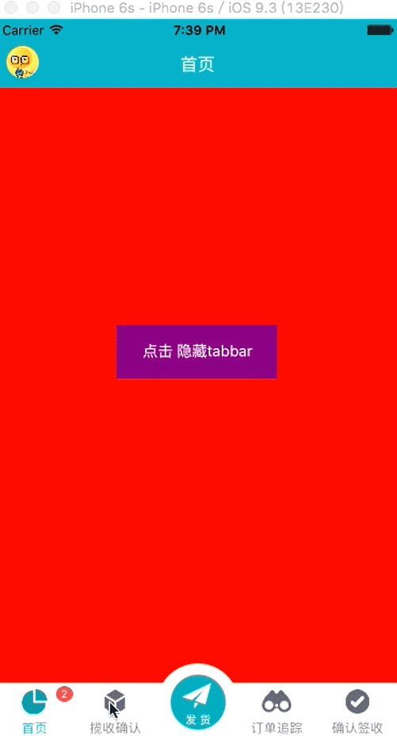

# QQSliderTabbarDemo
## 基于ICSDrawerController的侧滑 自定义tabbar  可隐藏tabbar 带有徽标

### 将controller Tabbar LeftSlider 拖入项目中


## 首页
```iOS
 RootTabBarController *tabbarVC = [[RootTabBarController alloc]init];
 LeftViewController *leftVC = [[LeftViewController alloc]init];
 ICSDrawerController *drawer = [[ICSDrawerController alloc]initWithLeftViewController:leftVC centerViewController:tabbarVC];
 self.window.rootViewController = drawer;
```

## Tabbar

```iOS
 OneViewController * home = [OneViewController new];
 home.tabBarItem.badgeValue = @"2";
 TwoViewController * confirm = [TwoViewController new];
 ThreeViewController * order = [ThreeViewController new];
 FourViewController * sign = [FourViewController new];
 FiveViewController *five = [FiveViewController new];
 self.viewControllers =@[home,confirm,order,sign,five];
 home.oneHiddenBlock = ^(BOOL isHidden){
        //isHidden这个值来自隐藏和显示tabbar
        //获取值后，做相应的处理
        _viewCustomTabbar.hidden = isHidden;
    };

```
